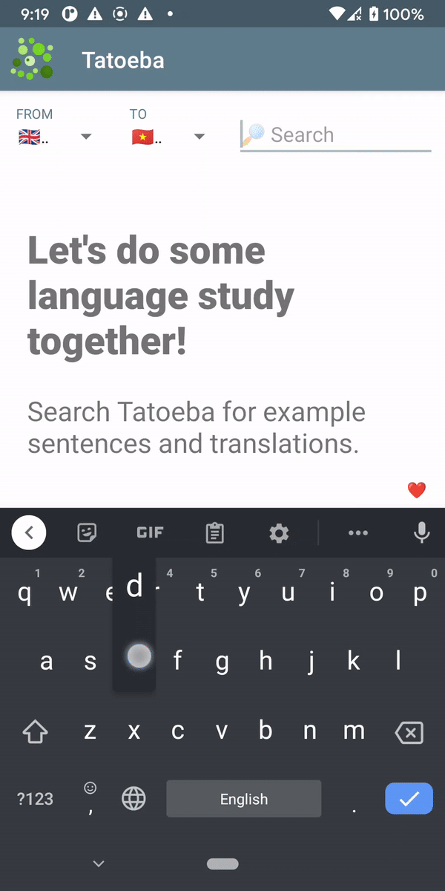
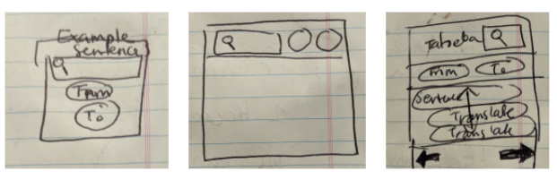

# Tatoeba Android Application

This is an Android application for [Tatoeba](https://tatoeba.org). Tatoeba is a collection of sentences and translations that is open-source and collaborative. It's great for language study - I use it all the time for finding example sentences for a better idea of how to use new vocabulary! This project was motivated by the fact that the existing mobile version of the Tateoba website is not the easiest to use. I thought this app could be an easier and more pleasant way of interacting with Tatoeba on your mobile device!

Hope you all enjoy it! A short demo of the way the application works (simply select a source and target language, enter a search query, and get delivered example sentences and translations):

  

# Developer's Log

This is the second Android application I've made. I definitely learned a lot from my first try at Android app development, so this time around, I approached the project much differently. I started by making wireframes to detail the flow of my application right off the bat. This made things *a lot* easier. It helped me develop a UI which was more intuitive to use and was also a more efficient use of different features. This overall made the project much easier to tackle, reducing the amount of undo/redo I had to do when putting the app together, and also decreasing the number of features I had to implement. I quite like how the design turned out!

With increased familiarity with some of the tools, I also thought it might be fun to experiment how to incorporate some Python scripts into the overall framework (I'd like to do this for a future project I've been planning. So a bit of a trial run!) I wrote a web scraper to query Tatoeba's website using the Python package BeautifulSoup, which was pretty fun. It was my first time trying web scraping (I'm more of a computer vision gal), so I had fun wrestling with regex's and unicode troubles - thanks to @SpenDM for lending some of your NLP chops! I ended up using Chaquopy to incorporate the Python script into the Android application. It was pretty straightforward to use.

Overall, I'm very happy with the final product! I think that it looks much more professional than my last attempt (Finally getting a hang of the Layout Editor!) I need to obtain an open source license from Chaquopy so the app can stay open for long periods of time - expect an update on that soon!

  

<i>Some rough wireframes for the project. I'm not a UI/UX designer by any means, but I thought it was quite fun to do (and very helpful!)</i>

# License

MIT License. See `LICENSE` for more details.